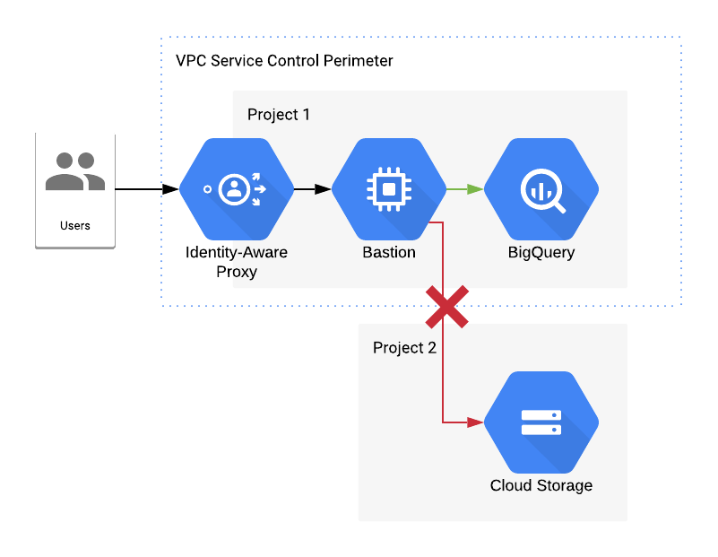

# VPC Service Controls Demo

## Dependencies

* `gcloud/bq`
* Org Admin Role

## Overview



This terraform code will create:

* 2 projects: source and target/attacker
* Bastion in a private subnet with Private Google Access enabled
* Firewall rule allowing SSH via IAP into the Bastion
* BigQuery Dataset/Table which is loaded with test data
* Target Bucket for the exfil attempt
* All necessary IAM bindings
* Org policy forbidding external IPs on Instances
* VPC Service Control perimeter around BigQuery and GCS in the source project

## Setup

There's a few steps needed to get this demo up and running properly or you'll have a difficult time setting it up later

1. Create a Seed Project
2. Use the [project factory helper script](https://github.com/terraform-google-modules/terraform-google-project-factory/blob/master/helpers/setup-sa.sh) to create a Service Account in your seed 
3. Since this service account will be creating BigQuery Datasets and Storage Buckets as well as VPC Service Control perimeters, it'll need a few more permissions. At the Org level, add `Access Context Manager Admin`, and at the Folder level, add `BigQuery Admin` and `Storage Admin` to the seed project Service Account.
4. Run `cp terraform.tfvars.sample terraform.tfvars` and then update that file with your own values.

Now you should be good to go. If not please create an issue detailing your problem so I can update this guide.

## Deployment

Since we have to first create the two projects, we have a Makefile that makes applying this easy. Just run:

```
make apply_projects
```

This will apply both source and target projects to test out VPC SC and subsequently write the IDs into the `env.sh`. This file is sourced first before the subsequent `apply`. Now you can run:

```
make apply
```


## Demo


First you'll want to get the bucket name from either the state or looking in the console:

```
terraform state show google_storage_bucket.target_bucket | grep url | cut -f2 -d'=' |sed -e 's/^ "//' -e 's/"$//'
```

Next log into the Bastion instance using `gcloud`. Notice how it will say something about tunnelling through IAP? 
That's because the instance doesn't have a public IP!

```
gcloud compute ssh bastion-vm
```

Once you're on the instance, you'll notice that you're logged in as the service account with a user like `sa_1234567890@bastion-vm` which tells you that OS Login was used.

Go ahead and take a look at your config, which should show you which service account you are using. You should be able to successfully run the following command and get some BigQuery data:

```
bq head project_1_dataset.cars
```


Now lets be a bit evil! We're going to attempt to exfil the data from this host to another GCP account that we own. 
Since we own it, we can grant the Service Account for the bastion Owner permissions on the target account. This was already
done for you in the Terraform in `storage.tf`. Since we are Owner of the target account, without VPC SC, we could extract the
entire table into a GCS bucket that we own, but with VPC SC protecting our BigQuery, that won't work. Let's try it anyway! 
Using the bucket name you printed earlier (we'll call it BUCKET_URL), let's try to extract the cars table to the target bucket.
You should get an output that looks something like this:

```
bq extract project_1_dataset.cars BUCKET_URL/cars.csv
BigQuery error in extract operation: VPC Service Controls: Request is prohibited by organization's policy.
```

Success!! Data exfil prevented! But what about PasteBin? Or AWS S3? Or any number of services??

If you look at the subnet we put our Bastion in, you'll notice the line:

```
private_ip_google_access = true
```

You also may notice that we didn't give this thing a NAT. This means we limited the scope of egress traffic to ONLY Google APIs,
which subsequently means that you can't make outbound requests to these type of storage services over the internet. Now does this
mean you are completely safe from exfil? Absolutely not! As long as the user's machine has access to the bastion she can SCP data
from that host. There are other controls you can add as well but VPC SC mitigates a very common threat of data exfil.
